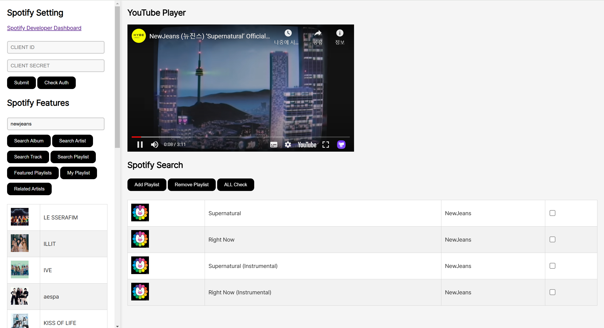

# tifytube

Spotify & Youtube Music Player

# Usage

1. Run "index.html".
2. Click "Spotify Developer Dashboard" to create an app.
3. Set up "CLIENT ID" and "CLIENT SECRET". 
4. Click the "Check Auth" button to verify the configured values.
